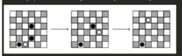

# Requirement
Jafar is playing checkers with his friend Aladdin. 
Checkers is a board game in which both players take turns to move their pawns.
Jafar has just one pawn left, and he is going to take a final turn, beating as many of Aladdin's pawns as possible.

Pawns in checkers move diagonally.
The pawn always moves one step in the up-right or up-left direction. 
If Jafar's pawn moves and its target field is occupied by one of Aladdin's pawns, Aladdin's pawn can be beaten: Jafar's pawn leaps over Aladdin's pawn, taking two steps in the chosen direction and removing Aladdin's pawn from the board. Jafar can beat Aladdin's pawn in this way only when the field beyond Aladdin's pawn is empty.
After beating Aladdin's pawn, 
Jafar can continue his turn and make another move, but only if he will again beat another one of Aladdin's pawns. Of course, after this additional move, Jafar can continue his turn again by beating another of Aladdin's pawns, and so on for as long as there are further pawns to beat. When it is no longer possible to beat one of Aladdin's pawns, Jafar's turn ends.
- For example, in the situation depicted below (where Jafar's pawn is white and Aladdin's pawns are black):

## Implemntation