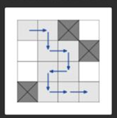
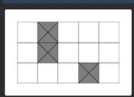
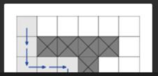

# Requirement
- A group of explorers is heading for an expedition into a cave.
- Map consisting of N rows and M columns. 
  - Rows represent levels of the cave and are numbered from 0 to N-1 from top to bottom.
  - Columns are numbered from 0 to M-1 from left to right and represent consecutive chambers on each level of the cave. Explorers can get through some chambers (marked'.) without any problem, but some other chambers (marked 'X*) are impossible to pass through as they contain too much debris and are unsafe.
- The expedition starts at the **top-left corner (0, 0)** of the cave and its goal is to get to the exit in the bottom-right corner (N-1, M-1). 
- **Explorers can move only to the chamber on the left, the chamber on the right or climb down to the lower level**. 
- Climbing up is too dangerous, so there is no possibility to move to the upper level after moving to a lower one. Formally, if the expedition is in chamber (R, C), the next chamber on their path may be only one of the following: (R+1, C), (R, C-1), (R, C+1).
- The explorers want to plan their path through the cave to explore as many chambers as possible.
- What is the maximum number of chambers the explorers can visit during the expedition? If it would be impossible to reach chamber (N-1, M-1), for reasons of safety, the expedition should be canceled.
- Write a function:
  - int solution (String[] b);
  - given an array B consisting of N strings of equal length M, representing the map of the cave
  - returns maximum number of chambers the expedition can explore on its wav from chamber (0 0) to the exit

- Example
1. Given B = ["..X.", "...X" , "....","X..."], your function should return 9.

   
2. Given B = [".X...", ".X...", "...X."], your function should return -1. The explorers would not be able to
      reach the exit chamber as it would require climbing to an upper level of the cave.
   
   

3. Given B = ["......",".XXXX.","...X..","...X.X","......"], 14 path is unique: 
 
   
# Hints
- Use BFS
- Write current position + length
- Know when call back

## DFS AWS Q

I've refactored the code with the following improvements:
[CaveDFSAwsQ.java](../../java/cave/CaveDFSAwsQ.java)
1. **Removed unnecessary dependencies**:

   - Eliminated the java.awt.* import and replaced Point with direct row/column parameters

2. **Optimized visited cell tracking**:
   - Replaced string-based keys with integer encoding for positions, which is more efficient
   - Added an encodePosition method to convert row/col to a single integer
3. **Simplified the context structure**

   - Replaced SolutionContext with a simpler Result class that only tracks what's needed

   - Removed the redundant found flag since we can check if maxLength is -1

4. **Improved method naming and parameters:**

   - Renamed search to dfs to better reflect its purpose
   - Changed x/y coordinates to row/col for better readability
   - Renamed isInbound to isValid and combined the empty cell check

5. **Optimized conditionals:**
   - Combined boundary and empty cell checks into a single isValid method
   - Used Math.max for cleaner maximum length tracking

These changes make the code more efficient, easier to read, and maintain the same functionality while reducing the overall complexity.

Yes, there's an opportunity to improve the Result class and how we handle the result value. Here are a few improvements we could make:

1. We could use an AtomicInteger instead of a custom class for thread safety (though not necessary in this case)

2. We could use a primitive int[] array of length 1 for a more lightweight solution

3. We could use a more descriptive name for the result variable

4. We could initialize the result with a more appropriate default value

**Solution**: The simplest and most efficient improvement would be to use an int[] array instead of a custom class. This avoids creating an extra class while still allowing us to modify the value from within the recursive method.

