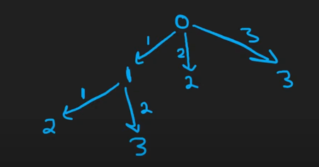

# Reading
- https://leetcode.com/problems/jump-game/description/
```sh
Example 1:

Input: nums = [2,3,1,1,4]
Output: true
Explanation: Jump 1 step from index 0 to 1, then 3 steps to the last index.
Example 2:

Input: nums = [3,2,1,0,4]
Output: false
Explanation: You will always arrive at index 3 no matter what. Its maximum jump length is 0, which makes it impossible to reach the last index.
```

## Cheking
- [3,2,1,0,4]
- [0,1,2,3,4]

## Brute Force
[BruteForce](../../../src/main/java/JumpGame/BruteForce/JumpGame.java)



## Solution 
### BFS

### Greedy

